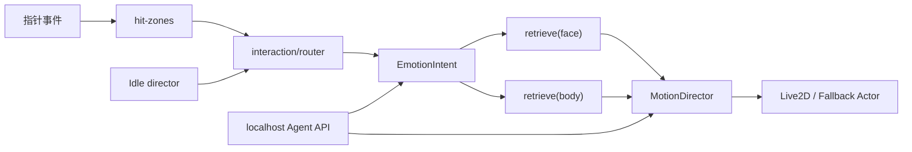

# Nori — Live2D 桌面宠物（交互 / 表情 Demo）

无边框透明置顶的 Electron 桌宠。重点不是聊天或截屏，而是**点得有感觉、表情接得自然**：点击分区、悬停注视、右键菜单缩放、眼/头跟随，以及一套可测试的 `retrieve(intent)` 双层动作检索。

> 本仓库是全新 MIT 实现，**没有克隆或复制** [Live2DPet](https://github.com/x380kkm/Live2DPet) 源码。只吸收了它公开的产品想法（透明置顶窗、拖拽、点击热区、菜单缩放、眼神跟随、情绪驱动表情）。

## 快速开始

```bash
npm install
npm test
npm start          # 推荐：node launch.js，避开 ELECTRON_RUN_AS_NODE
```

Windows 上填好官方 Sample 模型路径后，会弹出透明置顶角色窗；托盘可退出。

没有 Cubism Core / 模型时，会使用**原创占位角色 Nori**（非任何游戏模型），交互与检索链路仍然完整。

浏览器预览（开发 / 无桌面环境）：

```bash
npm run preview
```

默认地址：`http://127.0.0.1:43187`

> 若在 VS Code 终端里直接 `npx electron .` 没窗口，是因为 `ELECTRON_RUN_AS_NODE=1`。请用 `npm start` 或 `node launch.js`。

## 本地 Agent 控制 API（slice 1）

主进程在 **127.0.0.1** 提供一个无 LLM 的控制口，外部 agent 用 JSON 驱动 `MotionDirector`，不必把模型塞进渲染进程。

默认端口 `3927`（环境变量 `NORI_CONTROL_PORT` 或配置项 `agentControlPort`）。**只绑定回环地址**。v1 **没有鉴权**：本机任意进程都能发指令，不要把该端口映射到局域网或公网。关闭：`NORI_CONTROL_DISABLED=1`。

```bash
curl -sS -X POST http://127.0.0.1:3927/intent \
  -H "Content-Type: application/json" \
  -d '{"emotion":"happy","intensity":0.7,"motionHint":"smile","say":"hello"}'
```

成功：`{"ok":true,"played":{...}}`。`say` 目前只记日志（聊天气泡 UI 未做）。可选字段：`variant`、`source`。可选 WebSocket：`ws://127.0.0.1:3927/intent`，报文同 JSON。

## 放置 Cubism Core（不随仓库分发）

`live2dcubismcore.min.js` 受 Live2D 许可约束，**禁止再分发**，本仓库也不提交该文件。

1. 从 [Cubism SDK for Web](https://www.live2d.com/sdk/download/web/) 下载并同意官方许可。
2. 把 `live2dcubismcore.min.js` 放到：

```
vendor/live2dcubismcore.min.js
```

详见 [`vendor/README.md`](vendor/README.md)。配置项：`cubismCorePath`。

## 使用官方免费 Sample 模型（例如 Hiyori）

本仓库**不捆绑任何版权角色模型**（也不应提交到 Git）。请只在本地放入你拥有授权或官方 Sample 的模型/动作；`assets/kanade/`、`assets/model/` 已加入 `.gitignore`。若历史提交里曾误传私有资源，请用 git filter-repo 清理后再 force-push。请使用 Live2D 官方免费 Sample，例如 [Hiyori Momose](https://www.live2d.com/en/learn/sample/)。

1. 下载并解压官方 Sample（Cubism 4 `.model3.json`）。
2. 复制 `config/windows.example.json` → `config/local.json`（不入库），按本机路径改：

```json
{
  "modelPath": "C:/Live2D/Hiyori/hiyori_pro_t11.model3.json",
  "cubismCorePath": "vendor/live2dcubismcore.min.js",
  "motionsTagsPath": "C:/Live2D/motions/motions.tags.json",
  "motionsDir": "C:/Live2D/motions"
}
```

未放本地 catalog 时，仓库默认 `config/app.config.json` 使用：

- `motionsTagsPath`: `fixtures/motions.tags.sample.json`
- `motionsDir`: `""`（空则只走 sample catalog + 参数混合）

3. 再次 `npm start`。

相对路径相对仓库根目录；Windows 绝对路径用正斜杠即可（`C:/...`）。`config/local.json` 不会提交。

### 指向本地完整动作目录

`config.motionsTagsPath` 指向 `motions.tags.json`（schemaVersion 1），`config.motionsDir` 指向 `.motion3.json` 根目录。目录项的 `path` / `file` 会拼到 `motionsDir` 下。

占位示例（也可直接改 `config/windows.example.json` 后另存为 `config/local.json`）：

```json
{
  "motionsTagsPath": "C:/Live2D/motions/motions.tags.json",
  "motionsDir": "C:/Live2D/motions"
}
```

Demo 的 sample catalog 即使没有真实 motion 文件，也会用参数混合 + 占位/官方模型参数驱动表情，保证交互可见。

## 交互

| 操作 | 反应 |
| --- | --- |
| 左键拖角色 | 移动窗口（超过约 10px 才算拖动，避免误触动作） |
| 单击头/脸 | 害羞或开心 |
| 双击 | 兴奋 / 闪光（`eventOnly` 可入选） |
| 单击身体 | 点头或歪头回应 |
| 悬停 1.2s | 好奇注视 |
| 右键 | 打开设置弹层（叠在裁切窗口内，可拖标题栏；点空白 / Esc / 再右键关闭） |
| 设置 · 大小 | 缩放 0.6–1.8，以显示范围底边为锚点（仅此滑杆，无滚轮缩放） |
| 设置 · 显示范围 | 窗口裁切：头肩 / 上半身 / 到腰 / 全身 |
| 设置 · 贴边吸附 | 默认关；开时拖到距屏幕工作区边缘 ≤8px 松手对齐 |
| 设置 · 系统 | 待机 / 随机情绪 / 穿透 / HUD / 退出 |
| 鼠标移动 | `ParamAngle*` / `ParamEyeBall*` 阻尼跟随 |
| `H` | 调试 HUD（当前 intent + face/body id，叠在窗口左下） |
| 托盘 | 退出等（桌宠不占任务栏） |

鼠标穿透打开后，窗口不挡操作，只能用托盘关穿透。关闭穿透时，空白像素会自动穿透，只有角色本体接收点击。

## `retrieve(intent)` 与目录

`fixtures/motions.tags.sample.json` 为 schemaVersion 1 示例（约 28 条）。检索规则写在 `catalog.retrieval`：

```
EmotionIntent = { emotion, variant?, intensity 0..1, contextTags[], styleHint?, event? }
```

1. 按 `layer` + `exclusiveGroup` 分 face / body 两个互斥池。
2. **硬过滤 emotion**；没有命中则回退 `neutral`。
3. `eventOnly` 仅当 `intent.event` 为真（例如双击闪光）。
4. 加分：`+variant` `+context` `+styleHint` `+intensityFit` + `item.weight`。
5. 冷却 + 去重（anti-repeat），再在 top-N 里随机取 1 条。
6. face 与 body 同时存在时一起播；同一 id 冷却内不重开。
7. Idle director 每隔数秒播低强度呼吸/姿态，不刷屏。
8. 参数向中性位平滑回落。

单元测试：

```bash
npm test
```

覆盖硬过滤、neutral 回退、eventOnly、加分项、冷却/去重、top-N、双层配对。

## 架构

```
Electron 主进程
├── launch.js              清除 ELECTRON_RUN_AS_NODE 后拉起 Electron
├── src/main/index.ts      透明置顶窗 / IPC / 托盘 / agent 控制口
├── src/main/agent-control-server.ts   127.0.0.1 HTTP + 可选 WS
├── src/main/config.ts     modelPath / motionsTagsPath / motionsDir
└── src/main/preview-server.ts   浏览器预览

渲染进程
├── src/renderer/pet.ts           交互循环、缩放、右键设置
├── src/renderer/live2d-actor.ts  PIXI v7 + pixi-live2d-display/cubism4
└── src/renderer/fallback-actor.ts 原创占位角色

情绪 / 交互（可单测）
├── emotion/retrieve.ts    retrieve(intent) 计分
├── emotion/director.ts    双层播放 + idle + 冷却
└── interaction/router.ts  本地事件 → EmotionIntent（预留 API classifier stub）
```



## 与 Live2DPet 的关系

**吸收的想法（非源码）**

- 透明、无边框、置顶桌宠窗
- 拖拽、点击热区、悬停、菜单缩放
- 眼/头跟随鼠标
- 用情绪驱动表情/动作
- 托盘退出、`launch.js` 规避 `ELECTRON_RUN_AS_NODE`

**本项目原创**

- `motions.tags.json` schemaVersion 1 + 文档化 `retrieve()` 计分
- face / body 双池与 exclusiveGroup
- 本地 intent router（Demo 不需要云端 AI）
- Idle director、交叉淡化、冷却防抖、调试 HUD
- TypeScript 模块边界：`main/` `renderer/` `emotion/retrieve.ts` `interaction/router.ts`
- 无截屏、无 TTS、无聊天； Cubism Core 与版权模型都不进仓库

## 技术栈

- Electron（Windows 优先，Linux / macOS 也能跑预览）
- PIXI.js v7
- `pixi-live2d-display@0.5.0-beta`（PIXI 7 兼容，Cubism 4）
- TypeScript + vitest

## 许可

MIT。Live2D Cubism Core 与官方 Sample 模型遵循各自的 Live2D 许可，需自行下载，不得随本程序再分发 Core。
